# Pipeline ci 
## Run with jest 
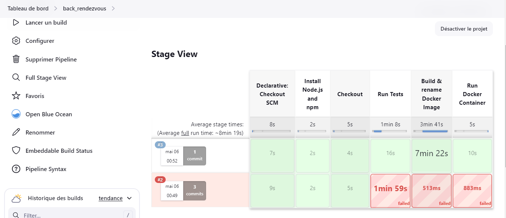

## stage push to docker 

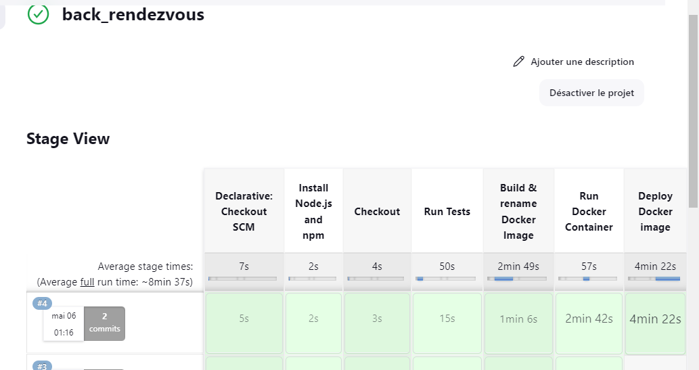

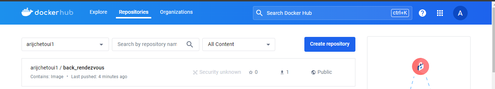

------------------------------
### deploy docker-compose 

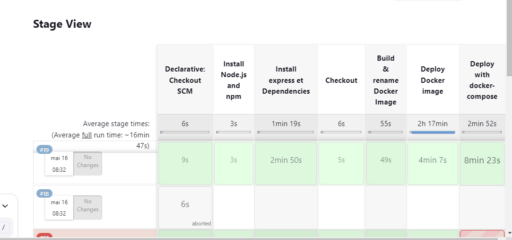

------------------------------

# kubernet deploy image docker 

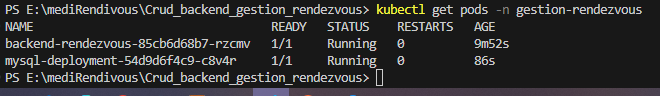

## init k8s de bd image 
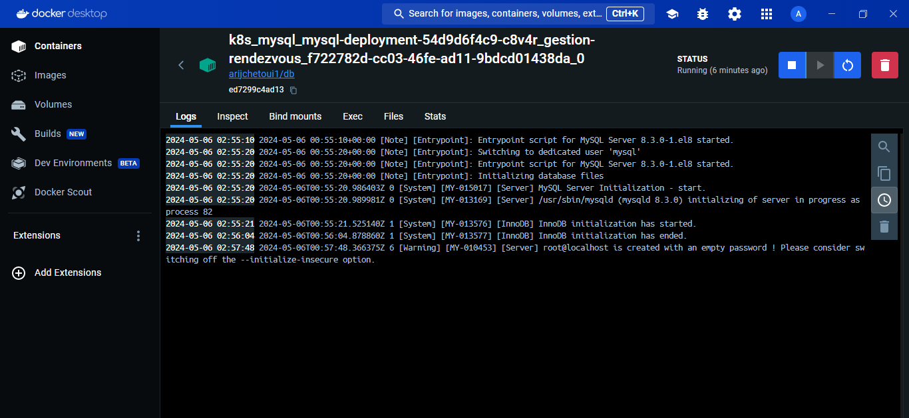

## start de k8s de bd image 
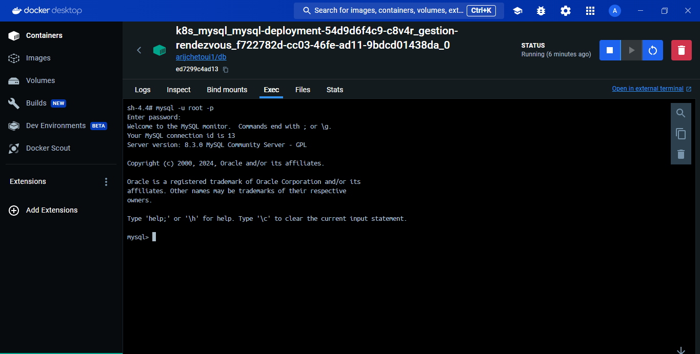

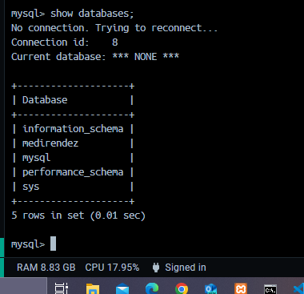

## use database medirendez 
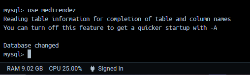

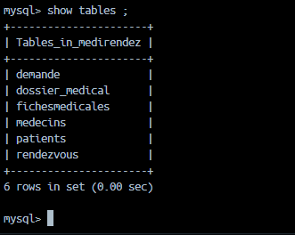

## prb de connexion entre image de back et image le bd 

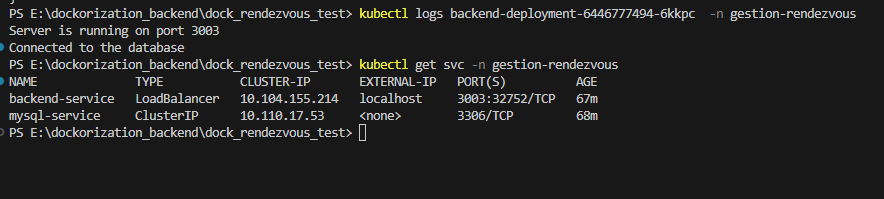
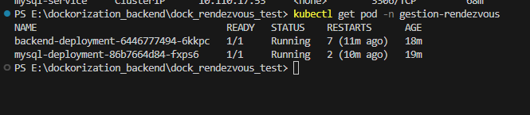
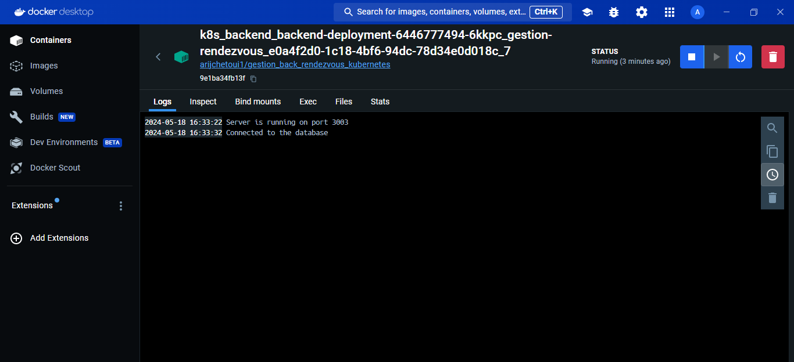

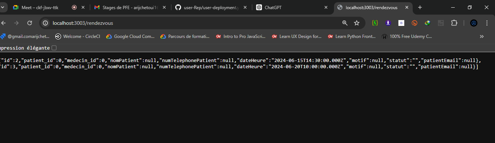

# Pipeline Compl

