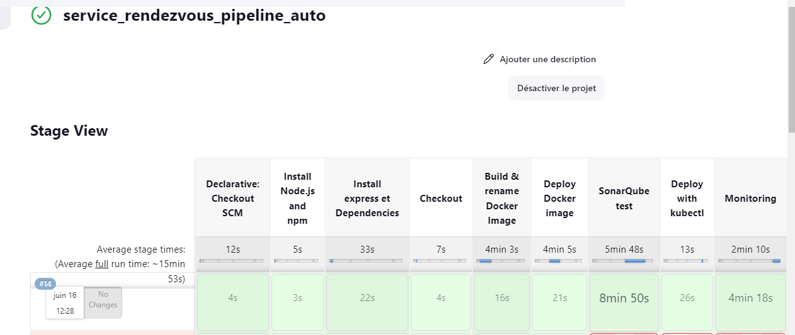

# Pipeline ci 
## Run with jest 

## stage push to docker 

------------------------------
### deploy docker-compose 

------------------------------

# kubernet deploy image docker 

## init k8s de bd image 

## start de k8s de bd image 

## use database medirendez 

## prb de connexion entre image de back et image le bd 

# Pipeline Compl

